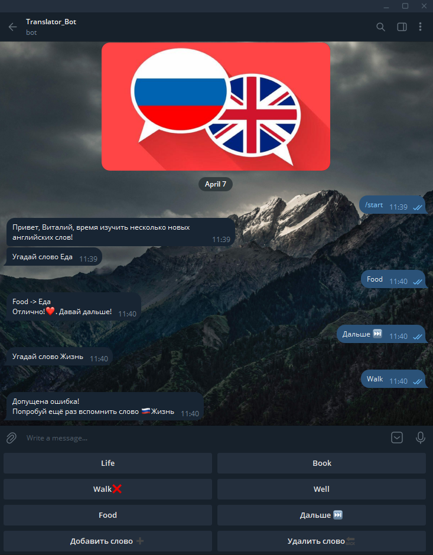
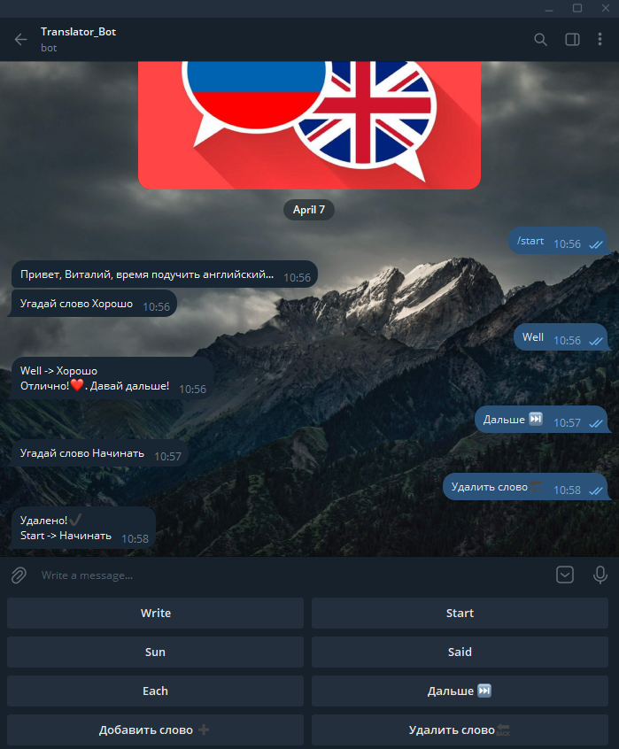
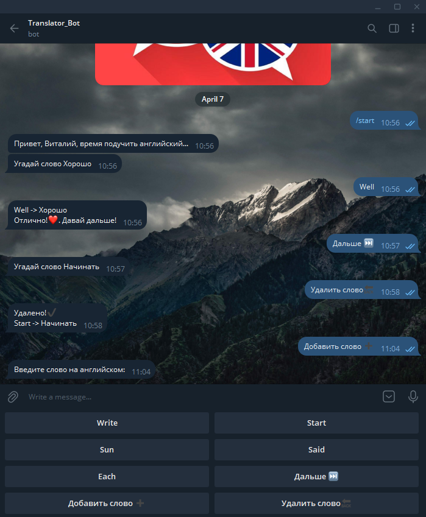
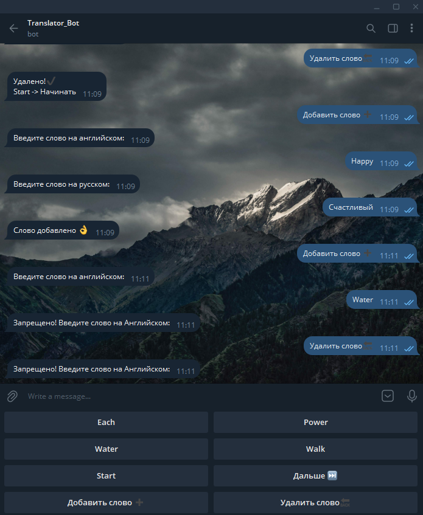

# > Translator_bot - телеграмм бот по изучению английских слов

## Приветствуем в нашем Телеграм-боте! Ссылка на сам бот [Telegram](https://t.me/Kanin_telegram_bot)
### С помощью данного боты вы сможете быстро изучить английские слова угадыванием слов поочередно. 

Как пользоваться данным ботом:

1) Для начала нужно перейти по [Ссылке в Телеграм](https://t.me/Kanin_telegram_bot) и нажать кнопку START
   

3) После приветствия бот предложит Вам угадать слово. Вы можете угадать, удалить, добавить слово либо пройти дальше.   

5) Предположим вы выбрали нужный перевод, нажмите кнопку 'Дальше ⏭' чтобы перейти к следующему слову, либо выберите другую команду.
   

В случае выбора ошибочного перевода бот предложит вам угадать слово еще раз 

7) При нажатии кнопки "Удалить слово🔙" будет удалено последнее слово которое нужно было угадать. Слово будет удалено из вашего персонального списка.
   

9) Чтобы добавить новое слово нажмите кнопку "Добавить слово ➕". Система запросит у вас ввести слово на английском, затем на русском
    

В случае верного ввода слово будет добавлено персонально для вас. Запрещено при этом нажимать на кнопки когда вы добавляете слово

##### Файл настроек называется [settings.json](settings.json), укажите в нём токен и параметры подключения к БД.
#### Приятного пользования!